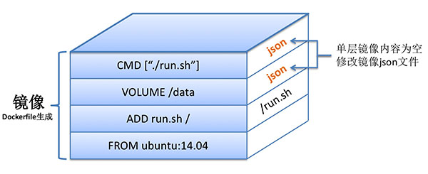

## Dockerfile 操作建议

Docker可以读取一个Dockerfile文件来构建所需的镜像，这个文件里包含所有所需要的指令。Dockerfile文件用特有的格式来设置镜像信息，更多基础知识在 [Dockerfile 参数详解](dockerfile_details.md) 会详细展示。

本文包含Docker官方提供的一些践以及方法，我们强烈建议你去参照这些建议。

官方建议：

1. 一个Dockerfile文件尽量```越简洁越好```，这意味着 它可以被停止销毁，然后被最小化配置安装到另一个地方。
2. 在通常情况下，最好把```
Dockerfile文件放到一个空目录```，然后，将构建镜像所需要动文件添加到该目录。为了提高构建性能，你也可以通过添加```.dockerignore```文件到该目录以排除文件和目录，该文件支持排斥的模式类似于.gitignore文件。
3. 为了```减少镜像复杂度、依赖、文件大小和构建时间```，应该尽量避免安装多余的不需要包，例如：你不需要在一个数据库镜像中添加一个文本编辑器。
4. 在绝大多数情况下，```每一个镜像只跑一个process```，应用于多个容器中可以方边应用横向扩展和重复利用容器。如果该服务依赖于其他服务，请使用容器互联。
5. 你需要在Dockerfile的可读性和镜像层次最小化之间取得平衡，要有目的且非常谨慎的控制使用分层的数量
6. 尽可能缓解由字母数字排序的多行参数后的变化。这将帮助你避免包的重复，使列表更容易更新。这也使得PRs更容易审查。在一个空格前面加一个反斜杠能起到帮助。

	下面是来自buildpack-DEPS镜像中的例子：

	    RUN apt-get update && apt-get install -y \
        bzr \
        cvs \
        git \
        mercurial \
        subversion

7. 构建缓存

	在构建镜像时，进程将为```
Dockerfile内每一个指定的执行步骤构建一个镜像```
。由于执行每条指令都会对它缓存内现有镜像进行检查，所以```
镜像可以重复利用```
，而不是创建一个重复的镜像。如果你不想使用缓存，请在docker build 时使用```
--no-cach=true```
 选项。

	但是，如果你让Docker使用构建缓存找到匹配的镜像，你应该了解它什么时候需要，什么时候不需要，所以要遵循以下规则：

	从缓存中启动一个基础镜像，执行下一条指令，比与上一层所有子镜像对比，```
查看是否有与已经存在的镜像相同```
，如果不同，缓存将失效。

	在大多数情况下，只需要简单地比较Dockerfile指令与其中一个子镜像就够了，但是，某些指令需要更多解释：

	对于ADD和COPY指令，镜像中的文件```
每个的内容将全部检查```
。文件的某些信息是不检查的：最近更新时间和最后访问时间。在查找缓存期间，Docker会与已经存在的镜像文件进行校验，```
如果文件被更改，例如内容或元数据，那么缓存也将失效```
。除此之外，ADD和COPY指令缓存将不会查看容器内文件来匹配缓存。例如，当执行一个 RUN apt-get -y 指令时，不会检查容器内文件更新来确定缓存是否存在。在这种情况下，将使用指令字符串本身来查找缓存匹配。

	上文所提到动缓存失效，是指```
后续指令将会产生新的镜像文件，缓存将不会被使用```
。


###镜像文件的大小


** Dockerfile 与镜像 **

Dockerfile 由多条指令构成，随着深入研究 Dockerfile 与镜像的关系，很快大家就会发现，Dockerfile 中的```
每一条指令都会对应于 Docker 镜像中的一层```
。

以如下 Dockerfile 为例：

	FROM ubuntu:14.04
	ADD run.sh /
	VOLUME /data
	CMD ["./run.sh"]

通过 docker build 以上 Dockerfile 的时候，会在 ubuntu:14.04 镜像基础上，添加三层独立的镜像，依次对应于三条不同的命令。镜像示意图如下：

 


有了 Dockerfile 与镜像关系的初步认识之后，我们再进一步联系到每一层镜像的大小。

不得不说，在层级化管理的 Docker 镜像中，有不少层大小都为 0。那些镜像层大小不为 0 的情况，归根结底的原因是：```
构建 Docker 镜像时，对当前的文件系统造成了修改更新```
。而修改更新的情况主要有两种：

1. ADD或 COPY 命令：ADD 或者 COPY 的作用是在```
 docker build  构建镜像时向容器中添加内容```
，只要内容添加成功，```
当前构建的那层镜像就是添加内容的大小```
，如以上命令 ADD run.sh /，新构建的那层镜像大小为文件 run.sh 的大小。

2. RUN 命令```
：RUN 命令的作用是在当前空的镜像层内运行一条命令```
，倘若运行的命令需要更新磁盘文件，那么所有的更新内容都在存储在当前镜像层中。举例说明：```
RUN echo Hello world 命令不涉及文件系统内容的修改```
，故命令运行完之后当前镜像层的```
大小为 0```
；```
RUN wget http://abc.com/def.tar```
 命令会将压缩包下载至当前目录下，因此当前这一层镜像的大小为：对文件系统内容的增量修改部分，即 ```
def.tar 文件的大小```
（在成功执行的情况下）。


** 联合文件系统 **

Dockerfile 中```
命令与镜像层一一对应```
，那么是否意味着 docker build 完毕之后，镜像的```
总大小是否等于每一层镜像的大小总和```
呢？答案是```
肯定的```
。依然以上图为例：如果 ubuntu:14.04 镜像的大小为 200 MB，而 run.sh 的大小为 5 MB，那么以上三层镜像从上到下，每层大小依次为 0、0 以及 5 MB，那么最终构建出的镜像大小的确为 0 + 0 + 5 + 200 = 205 MB。

虽然```
最终镜像的大小是每层镜像的累加```
，但是需要额外注意的是：Docker ```
镜像的大小并不等于容器中文件系统内容的大小```
（不包括挂载文件，/proc、/sys 等虚拟文件）。个中缘由，就和联合文件系统有很大的关系了。

首先来看一下这个简单的 Dockerfile 例子（假如在 Dockerfile 当前目录下有一个 100 MB 的压缩文件 compressed.tar）：

	FROM ubuntu:14.04
	ADD compressed.tar /
	RUN rm /compressed.tar
	ADD compressed.tar /


1. FROM ubuntu:14.04：镜像 ubuntu:14.04 的```
大小为 200 MB```
；
2. ADD compressed.tar /： compressed.tar 文件为 100 MB，因此```
当前镜像层的大小为 100 MB```
，镜像```
总大小为 300 MB```
；
3. RUN rm /compressed.tar：删除文件 compressed.tar，此时的删```
除并不会删除下一层的 compressed.tar 文件```
，只会在当前层```
产生一个 compressed.tar 的删除标记```
，确保通过该层将看不到 compressed.tar，因此```
当前镜像层的大小也为 0```
，镜像```
总大小为 300 MB```
；
4. ADD compressed.tar /：compressed.tar 文件为 100 MB，因此```
当前镜像层的大小为 300 MB + 100 MB```
，镜像```
总大小为 400 MB```
；

分析完毕之后，我们发现镜像的总大小为 400 MB，但是如果```
运行该镜像```
的话，我们很快可以发现在容器根目录下执行 du -sh 之后，显示的数值并非 400 MB，而是 ```
300 MB 左右```
。主要的原因还是：联合文件系统的性质保```
证了两个拥有 compressed.tar 文件的镜像层，容器仅能看到一个```
。同时这也说明了一个现状，当用户基于一个非常大，甚至好几个 GB 的镜像运行容器时，在容器内部查看根目录大小，发现竟然只有 500 MB 不到，甚至更小。

分析至此，有一点大家需要非常注意：```
镜像大小和容器大小有着本质的区别```
。

** 镜像共享关系 **

Docker 镜像说大不大，说小不小，但是一旦```
镜像的总数上来```
之后，岂不是对本地磁盘造成很大的存储压力？平均每个镜像 500 MB，岂不是 100 个镜像就需要准备 50 GB 的存储空间？

结果往往不是我们想象的那样，Docker 在```
镜像复用```
方面设计得非常出色，大大节省镜像占用的磁盘空间。Docker 镜像的复用主要体现在：```
多个不同的 Docker 镜像可以共享相同的镜像层```
。

假设本地镜像存储中只有一个 ubuntu:14.04 的镜像，我们以两个 Dockerfile 来说明镜像复用：

	FROM ubuntu:14.04
	RUN apt-get update
	FROM ubuntu:14.04
	ADD compressed.tar /

假设最终 docker build 构建出来的镜像名分别为 image1 和 image2，由于两个 Dockerfile 均```
基于 ubuntu:14.04```
，因此，image1  和 image2 这两个镜像均```
复用了镜像 ubuntu:14.04```
。 假设 ```
RUN apt-get update```
 修改的文件系统内容为 20 MB，最终本地三个镜像的大小关系应该如下：

	ubuntu:14.04： 200 MB
	image1：200 MB（ubuntu:14.04 的大小）+ 20 MB = 220 MB
	image2：200 MB（ubuntu:14.04 的大小）+ 100 MB = 300 MB

如果仅仅是单纯的累加三个镜像的大小，那结果应该是：```
200 + 220 + 300 = 720 MB```
，但是由于镜像复用的存在，实际占用的磁盘空间大小是```
：200 + 20 + 100 + 320 MB```
，足足节省了 400 MB 的磁盘空间。在此，足以证明镜像复用的巨大好处。
