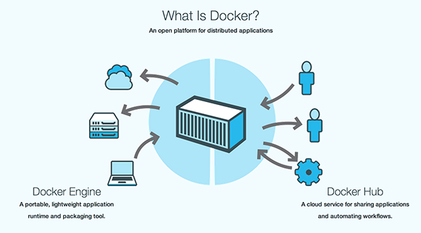

## Docker 简介

1. 由PaaS到Container

2013年2月，前Gluster的CEO Ben Golub 和 dotCloud 的 CEO Solomon Hykes 坐在一起聊天时，Solomon谈到想把 dotCloud    内部使用的Container容器技术单独拿出来开源，然后围绕这个技术开一家新公司提供技术支持。28岁点Solomon在使用python开发dotCloud的PaaS云时发现，使用LXC（Linux Container）技术可以打破产品发布过程中应用工程师和系统工程师两者之间无法轻松协作发布产品的难题。这个Container容器技术可以把开发者从日常部署的繁杂工作中解脱出来，让开发者能专心写好程序；从系统工程师到角度来看也是一样的，他们迫切需要从各种混乱的部署中解脱出来，让系统工程师专注在应用的水平扩展、稳定发布的解决方案上。他们深入交谈，觉得这是一次云技术的变革，紧接着在2013年3月Docker0.1发布，拉开来基于云计算平台发布产品方式的变革序幕。

1. Docker简介

Docker时Docker.lnc公司开源的一个基于LXC技术之上搭建的Container容器引擎，源代码托管在Github上，基于Go语言并遵从Apache2.0协议开源。Docker在2014年6月召开DockerConf2014技术大会吸引了IBM、Google、RedHat等业界知名公司的关注和技术支持，无论是从Github上到代码活跃度，还是RedHat宣布REHL7中正式支持Docker，都给业界一个信号，这是一项创新的技术解决方案。就连Google公司的Computer Engine 也支持Docker在其中之上运行，国内BAT先锋企业百度 Baidu App Engine（BAE）平台也是以 Docker作为PasS云基础。

Docker产生的目的就是要解决以下问题：

1）环境管理复杂：从各种OS到个粽中间件再到各种App，一款产品能够成功发布，作为开发者需要关心的东西太多，且难于管理，这个问题在软件行业中普遍存在并需要直接面对。Docker可以简化部署多种应用实例工作，比如Web应用、后台应用、数据库应用、大数据应用比如Hadoop集群、消息队列等等都可以打包成一个image部署。如下图所示：

2）云时代的到来：AWS的成功，引到开发者将应用转移到云上，解决来硬件管理的问题，然而软件配置和管理香瓜的问题依然存在。Docker的出现正好能帮助软件开发者开阔思路，尝试新的软件管理方法来解决这个问题。

3）虚拟化手段的变化：云时代采用标配硬件来降低成本，采用虚拟化手段来满足用户按需分配的资源需求以及保证可用性和隔离性。然而无论是KVM还是Xen，在Docker卡来都是在浪费资源，因为用户需要的是高校运行环境而非OS，GuestOS即浪费资源，又难于管理，更加轻量级大LXC更佳灵活和快速：

4）LXC的便携性: LXC在 Linux 2.6 的 Kernel 里就已经存在了，但是其设计之初并非为云计算考虑的，缺少标准化的描述手段和容器的可便携性，决定其构建出的环境难于分发和标准化管理(相对于KVM之类image和snapshot的概念)。Docker就在这个问题上做出了实质性的创新方法。

